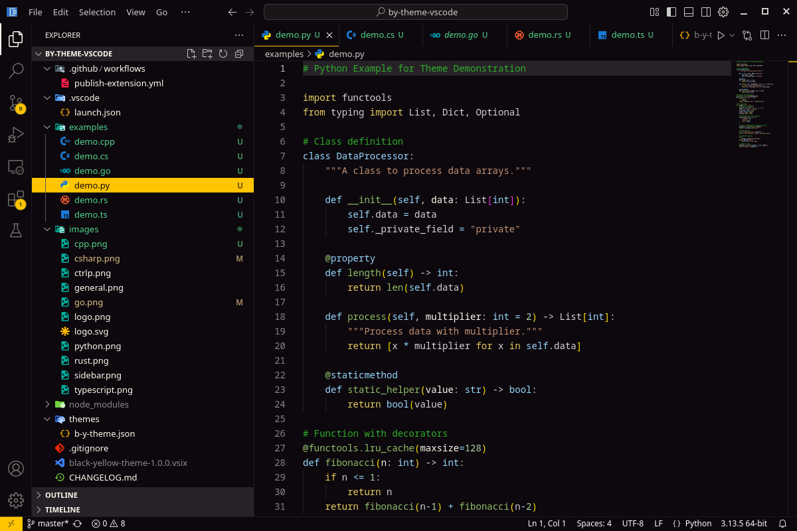
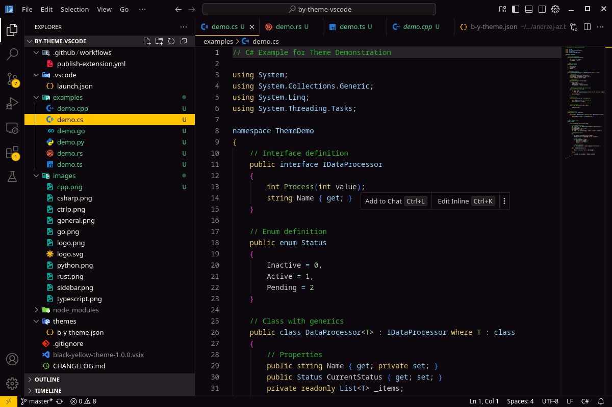
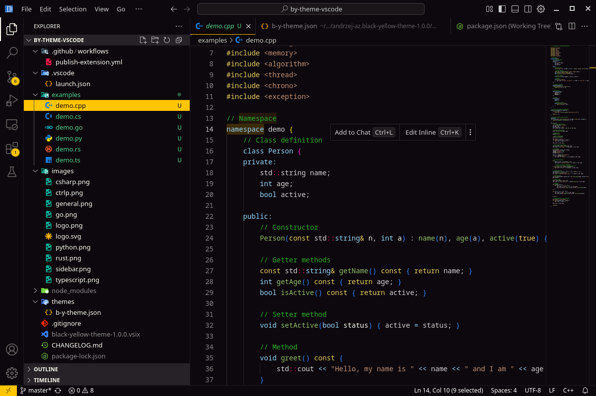
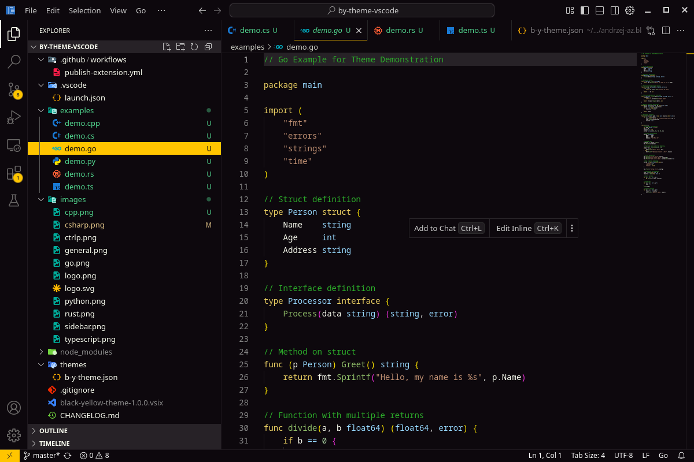
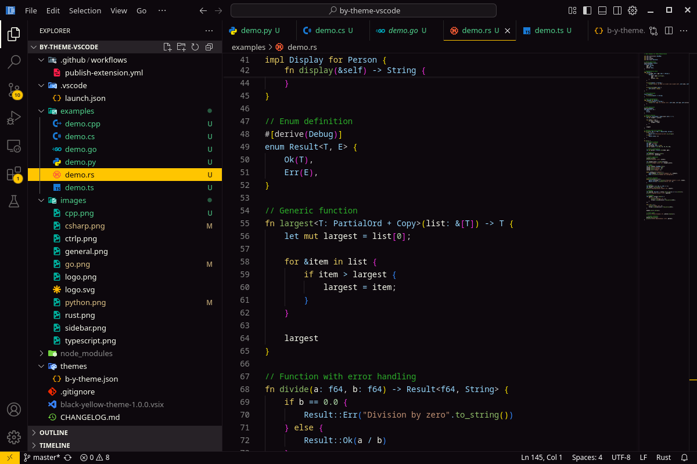
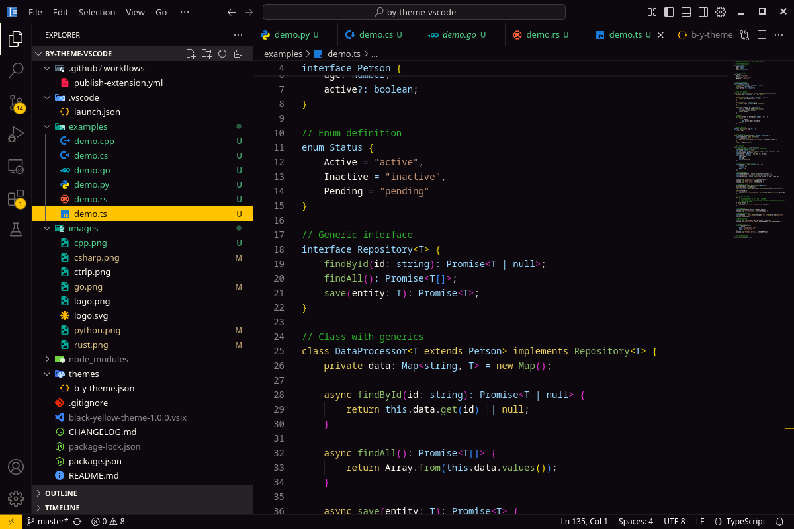

# Black-Yellow Theme

This is a fork of the Sunset Theme, providing a colorful theme with dark background and yellow accents for Visual Studio Code.

This theme provides color customization for all the main components of vscode:
* `editor`
* `peek view`
* `status bar`
* `activity bar`
* `panels`
* `etc ...`

Following screens use [Material Icons](https://marketplace.visualstudio.com/items?itemName=PKief.material-icon-theme) icon theme

[Forked from Sunset Theme](https://github.com/Swiiip/sunset-theme-vscode.git)
[GitHub repository](https://github.com/azakharchenko-msol/by-theme-vscode)

All comments/improvements are welcome !

# Installation

You can install this theme from the [Visual Studio Code Marketplace](https://marketplace.visualstudio.com/items?itemName=Andrzej-AZ.black-yellow-theme).

# Languages
## Python

## C-Sharp

## C++

## Go

## Rust

## Typescript

# Develop:
 - edit ~/.vscode/extensions/andrzej-az.black-yellow-theme-1.0.0/themes/b-y-theme.json 
 - reload vscode
# Publish:
 - Bump version in package.json
 - push
